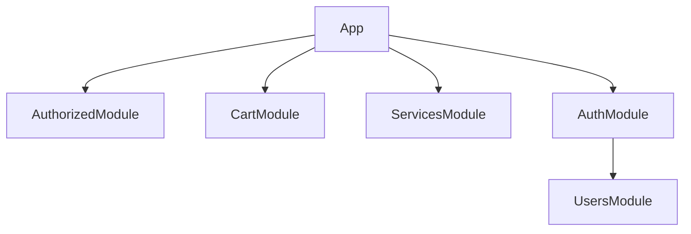
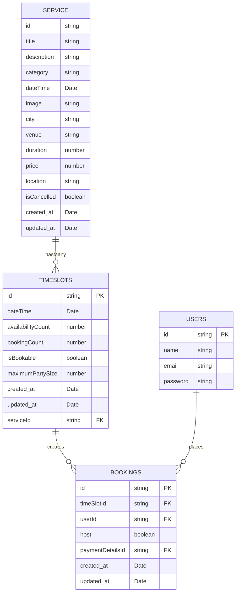
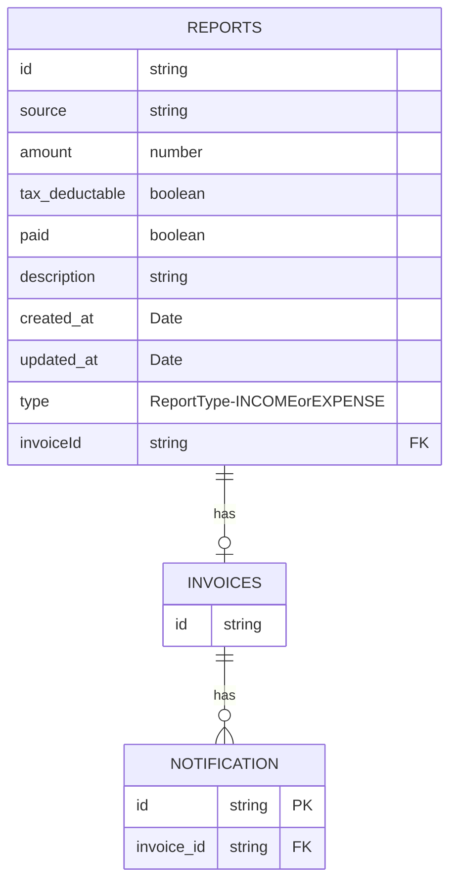

## Gary found this on his own.

```JS
console.log('Stop looking at this app')
```

nest:

```mermaid
graph TD;
    App-->AuthorizedModule;
    App-->CartModule;
    App-->ServicesModule;
    App-->AuthModule;
    AuthModule-->UsersModule;
```

```mermaid
erDiagram
    SERVICE ||--o{ TIMESLOTS : hasMany
    SERVICE {
        id string
        title string
        description string
        category string
        dateTime Date
        image string
        city string
        venue string
        duration number
        price number
        location string
        isCancelled boolean
        created_at Date
        updated_at Date
    } 
    TIMESLOTS ||--o{ BOOKINGS : creates
    TIMESLOTS {
        id string PK
        dateTime Date
        availabilityCount number
        bookingCount number
        isBookable boolean
        maximumPartySize number
        created_at Date
        updated_at Date
        serviceId string FK
    }
    BOOKINGS {
        id string PK
        timeSlotId string FK
        userId string FK
        host boolean
        paymentDetailsId string FK
        created_at Date
        updated_at Date
    }
    USERS ||--o{ BOOKINGS : places
    USERS {
        id string PK
        name string
        email string
        password string
    }

```

+serverless email reminders.

serverless:


```mermaid
erDiagram
    REPORTS ||--o| INVOICES : has
    REPORTS {
        id string
        source string
        amount number
        tax_deductable boolean
        paid boolean
        description string
        created_at Date
        updated_at Date
        type ReportType-INCOMEorEXPENSE
        invoiceId string FK
    }
    INVOICES ||--o{ NOTIFICATION : has
    INVOICES {
        id string
    }
    NOTIFICATION {
        id string PK
        invoice_id string FK
    }
```