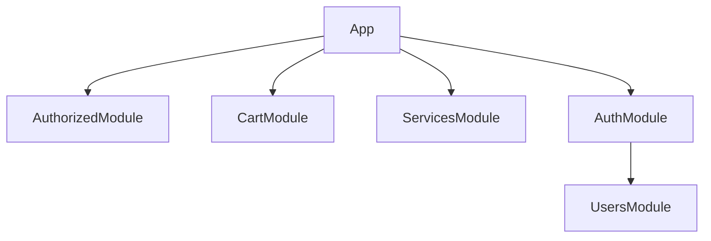
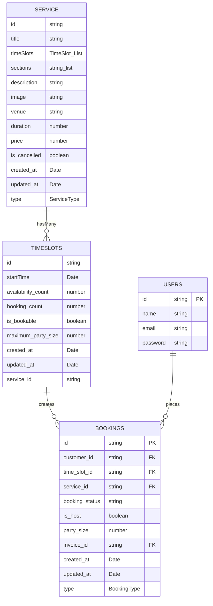
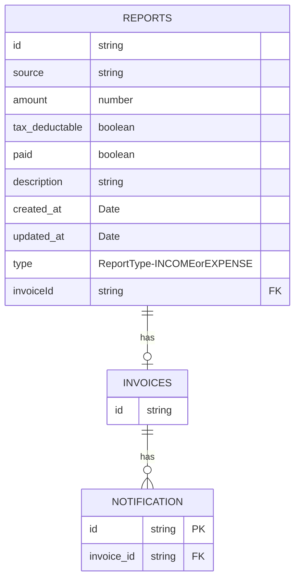

## Gary found this on his own.

```JS
console.log('Stop looking at this app')
```
Swagger:
http://localhost:3333/docs/

nest:

```mermaid
graph TD;
    App-->AuthorizedModule;
    App-->CartModule;
    App-->ServicesModule;
    App-->AuthModule;
    AuthModule-->UsersModule;
```

```mermaid
erDiagram
    SERVICE ||--o{ TIMESLOTS : hasMany
    SERVICE {
        id string
        title string
        timeSlots TimeSlot_List
        sections string_list
        description string
        image string
        venue string
        duration number
        price number
        is_cancelled boolean
        created_at Date
        updated_at Date
        type ServiceType
    } 
    TIMESLOTS ||--o{ BOOKINGS : creates
    TIMESLOTS {
        id string
        startTime Date
        availability_count number
        booking_count number
        is_bookable boolean
        maximum_party_size number
        created_at Date
        updated_at Date
        service_id string
    }
    BOOKINGS {
        id string PK
        customer_id string FK
        time_slot_id string FK
        service_id string FK
        booking_status string
        is_host boolean
        party_size number
        invoice_id string FK
        created_at Date
        updated_at Date
        type BookingType
    }
    USERS ||--o{ BOOKINGS : places
    USERS {
        id string PK
        name string
        email string
        password string
    }

```

+serverless email reminders.

serverless:


```mermaid
erDiagram
    REPORTS ||--o| INVOICES : has
    REPORTS {
        id string
        source string
        amount number
        tax_deductable boolean
        paid boolean
        description string
        created_at Date
        updated_at Date
        type ReportType-INCOMEorEXPENSE
        invoiceId string FK
    }
    INVOICES ||--o{ NOTIFICATION : has
    INVOICES {
        id string
    }
    NOTIFICATION {
        id string PK
        invoice_id string FK
    }
```